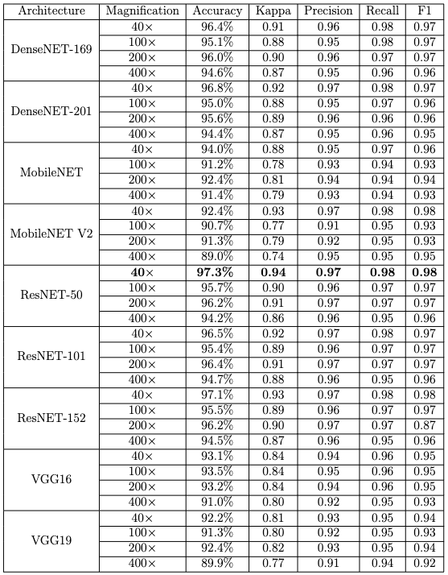
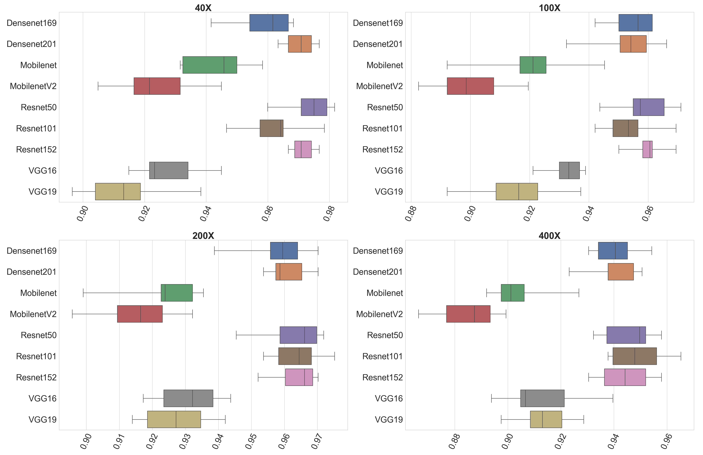

[Reduced dataset]: (https://drive.google.com/file/d/1g4tLeOEjHccGLw6n2RhPPciLR41G0dv5/view?usp=share_link)
[Dataset for 40x images]: (https://drive.google.com/file/d/14a0ziW05IK-aXCnA98i51bfAkiYarPm-/view?usp=share_link)
[Full BreakHis dataset]: (https://web.inf.ufpr.br/vri/databases/breast-cancer-histopathological-database-breakhis/)
[CSV's with extracted features]: (https://drive.google.com/drive/folders/1KB5ns1kj-7NrNmmJo-Gf3WpRqCgy6BL6?usp=share_link)
[Paper]: (https://sol.sbc.org.br/index.php/sbcas/article/view/21636)

# Introduction
Breast cancer is one of the most common forms of the disease in the world. It is estimated that about 8% of the female population will be affected at some point in their lives by this pathology. Despite all advances in the treatment of this disease, early diagnosis remains essential for the effectiveness of any applied technique. Allied to this purpose, several techniques and algorithms have been developed in the form of CADx (Computer Aided Diagnosis) systems, whose main objective is to help in the process of diagnosing the disease. In this context, the present work aims to present a methodology based on Deep Learning Features and Support Vector Machines for automatic classification of breast lesions in images of histopathological exams. When applied to the BreakHis image base, the methodology proved to be promising, with an accuracy of 97.3%.

## Breakhis dataset
To validate the presented methodology, were used the [BreakHis](https://web.inf.ufpr.br/vri/databases/breast-cancer-histopathological-database-breakhis/) image dataset.
This dataset contains 7909 images of histopathological exams divided by magnification. The magnifications are 40X, 100X, 200X and 400X.
The table bellow details this division.

|           | 40X  | 100X | 200X | 400X |
|-----------|------|------|------|------|
| Benign    | 625  | 631  | 636  | 588  |
| Malignant | 1370 | 1437 | 1390 | 1232 |


## Running
- Define the path of the dataset in the ```settings.py``` file.;
- The dataset needs to be organized following the bellow architecture. We provide functions to help with this task;
    ```
    dataset\
       40x\
           benign\
           malignant\
       100x\
           benign\
           malignant\
       200x\
           benign\
           malignant\
       400X\
          benign\
          malignant\
       
- Run the ```main.py``` file in order to start the process of feature extraction and classification;

## Paper
We also produced a [paper](static/Paper.pdf) that has a more detailed explanation of the approach adopted in this methodology.
There we present related works, detailed results and future enhancements for this work.

### Results

The following table shows the results achieved by the presented methodology  

<p align="center"> 

This next image is a boxplot detailing the accuracy results for all the architectures used to extract features.

<p align="center"> 

## Environment

Those are all the languages and tools used in the project

- Python 3.11
- PyCharm
- LaTeX
- Overleaf


## Important
- If you plan on running this project, we highly recommend to use the Python version showed in the previous section. We're also providing a `requirements` file with all the required dependencies.
- In case you're having a hard time trying to understand or run anything in this repo, feel free to contact me.